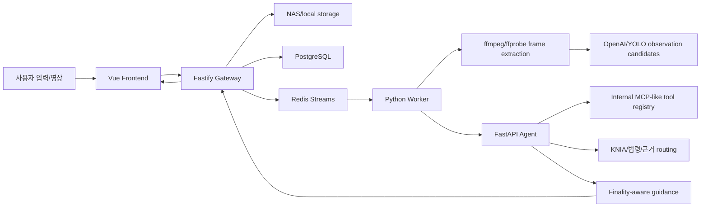

# 발표용 아키텍처 설명 기준

작성일: 2026-05-31

이 문서는 LawCompass 발표와 팀원 설명에서 현재 구현을 과장하지 않고 정확히 설명하기 위한 기준이다. 실제 코드 구조와 다른 표현을 피하고, 구현된 강점과 추후 적용할 구조를 분리해 설명한다.

## 1. 한 줄 설명

LawCompass는 교통사고 입력과 영상 관찰값을 바탕으로 사고축을 정리하고, KNIA 기준·법령 근거·과실비율 참고 범위·보험/대응 가이드를 근거 수준에 따라 제시하는 교통사고 분석 보조 시스템이다.

이 서비스는 판결을 확정하는 시스템이 아니라, 사용자가 사고 대응에 필요한 사실과 근거를 정리하도록 돕는 참고 가이드다.

## 2. 현재 구현된 것

| 영역 | 발표 표현 |
| --- | --- |
| MSA 서비스 분리 | Vue Frontend, Fastify Gateway, FastAPI Agent, Python Worker, PostgreSQL/Redis를 Docker Compose로 분리했다. |
| Gateway 책임 | 인증, 업로드, 분석 요청, DB 저장, 사용자/관리자 payload 분리, 결과 표시용 report 조립을 담당한다. |
| Worker 책임 | 영상 업로드 후 ffmpeg/ffprobe 기반 전처리, 대표 프레임 추출, OpenAI/YOLO 보조 관찰값 생성, Agent video 분석 요청을 담당한다. |
| Agent 판단 계약 | 사고축, 영상 관찰값, 사용자 입력, KNIA/법령 근거, 과실비율, 보험/형사/대응 가이드를 고정된 계약과 quality packet으로 관리한다. |
| 영상 관찰값 오염 방지 | 화면에 보이는 보행자·횡단보도·자전거 같은 주변 객체가 실제 충돌 대상인지 아닌지를 후보/확인/확정 상태로 분리한다. |
| 근거 finality | 근거 기반 참고 범위, 조건부 결과, 근거 부족 fallback, 추가 확인 필요 상태를 구분한다. |
| 내부 MCP-like tool registry | Agent 내부에서 허용된 tool을 schema, scope, timeout, failure packet, trace metadata와 함께 관리한다. |
| Task-Plan-Goal 확장 기반 | 현재 고정 pipeline에 plan, task packet, goal result, trace metadata를 붙여 실행 과정을 추적할 수 있게 했다. |

## 3. 부분 구현 또는 제한된 구현

| 영역 | 현재 한계 | 설명 방식 |
| --- | --- | --- |
| 표준 MCP | 표준 MCP Host/Client/Server는 도입하지 않았다. | “내부 MCP-like tool registry/executor를 구현했고, 표준 MCP는 도입 gate와 pilot 설계 후 보류했다.” |
| 독립 Agent process | 각 전문 Agent가 별도 프로세스로 자율 실행되는 구조는 아니다. | “역할 기반 analyst와 specialist result 계약을 강화했고, 완전 독립 Agent process는 운영 복잡도 때문에 후속 검토다.” |
| 영상 판단 | YOLO/OpenAI는 사고 판정 모델이 아니라 관찰 후보 생성 모델이다. | “영상에서 정량 관찰 후보를 만들고, Agent가 사용자 입력과 근거를 함께 조율한다.” |
| 판례/KNIA coverage | 실제 원문 DB coverage는 계속 보강 대상이다. | “근거 부족 시 확정처럼 말하지 않고 reference-only 또는 추가 확인 필요로 표시한다.” |
| 모바일/on-device 분석 | Capacitor/ML Kit/TFLite 적용은 아직 후속 단계다. | “웹 MVP 기준으로 먼저 안정화했고, 앱 패키징 이후 모바일 단말 분석을 검토한다.” |

## 4. 발표에서 강조할 강점

- 서비스 경계를 분리해 Frontend, Gateway, Agent, Worker의 책임을 나눴다.
- 영상과 사용자 입력이 서로 충돌할 때 한쪽을 무조건 믿지 않고 보류/확인/조건부 결과로 처리한다.
- 보행자가 화면에 보인다는 이유만으로 차대사람 사고로 오염되지 않도록 사고 대상과 환경 맥락을 분리한다.
- KNIA/법령/근거가 사고축과 맞지 않으면 1차 근거가 아니라 secondary 또는 excluded evidence로 분리한다.
- 과실비율은 단일 정답처럼 표시하지 않고 기본 범위, 조건부 분기, 추가 확인 fact를 함께 보여준다.
- 관리자 테스트 화면에서는 Agent 전달 전 영상 처리 결과와 Agent trace를 확인할 수 있고, 일반 사용자 화면에서는 raw debug 정보를 숨긴다.
- 표준 MCP는 무리하게 도입하지 않고, 현재 문제를 해결하는 내부 tool registry와 도입 gate를 먼저 안정화했다.

## 5. 피해야 할 표현

- “표준 MCP 서버/클라이언트 구현 완료”
- “전문 Agent들이 완전히 독립 실행되어 각자 goal을 제출한다”
- “영상만으로 사고 과실을 확정한다”
- “AI가 실제 판결 결과를 예측한다”
- “KNIA/판례 DB가 완전하다”
- “YOLO가 사고 판단을 한다”
- “보행자가 보이면 차대사람 사고로 판단한다”

## 6. 권장 발표 표현

```text
현재 LawCompass는 표준 MCP 서버를 붙인 구조라기보다, Agent 내부 tool registry와 실행 계약을 MCP-like하게 정리한 구조입니다.
도구마다 schema, scope, 실패 packet, trace metadata를 남겨 추후 표준 MCP로 확장할 수 있는 기준을 만들었습니다.
```

```text
영상 분석은 사고 결론을 바로 내리는 모델이 아니라, 신호, 차선, 충돌 대상, 정차, 중앙선, 보행자 주변 맥락 같은 관찰 후보를 만드는 역할입니다.
Agent는 이 후보를 사용자 입력과 KNIA/법령 근거와 비교해 확정, 보류, 조건부, 추가 확인 상태로 나눕니다.
```

```text
과실비율은 확정 판결이 아니라 참고 범위입니다.
근거가 충분한 경우에는 기준 범위를 제시하고, 상대 신호나 정차 사유처럼 결론이 갈리는 사실이 부족하면 조건별 결과와 추가 확인 항목을 함께 보여줍니다.
```

## 7. 현재 구조 요약



## 8. 추후 적용 후보

| 후보 | 도입 조건 |
| --- | --- |
| 표준 MCP Host/Client/Server | 외부 tool/Agent가 늘어나거나 표준 MCP client 연동, 다중 host tool 재사용, 독립 process 격리 요구가 생길 때 |
| 독립 Agent process | 현재 task packet과 specialist result 계약이 충분히 안정되고, 별도 lifecycle 운영 이득이 복잡도보다 커질 때 |
| 모바일 on-device vision | 앱 패키징 이후 서버 비용 절감과 개인정보 보호를 위해 단말 전처리가 필요할 때 |
| 판례/KNIA 원문 coverage 확장 | 실제 근거 DB coverage가 제품 신뢰도의 병목이 될 때 |
| S3 직접 업로드 | 대용량 영상 업로드와 운영 저장소 확장이 필요할 때 |

## 9. 영상처리/Agent 발표 인수인계

영상처리와 Agent 담당 범위를 발표자료로 정리할 때는 `docs/VIDEO_AGENT_PRESENTATION_HANDOFF.md`를 우선 참고한다.

해당 문서는 다음 내용을 발표용으로 풀어 쓴다.

- 영상 전처리, YOLO, OpenAI 프레임 분석, Agent fact arbitration의 연결 흐름
- 사용자 입력과 영상 관찰값의 반영 기준
- AI Agent가 LawCompass에서 활용되는 방식
- 자문위원 Q&A가 현재 프로젝트에 반영된 방식
- 프로젝트 구조 보강과 P12 전체 점검 결과
- 발표에서 피해야 할 과장 표현과 권장 표현
