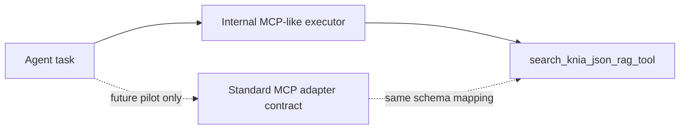

# 표준 MCP Pilot 설계

상태: active/reference
용도: 표준 MCP를 즉시 도입하지 않는 상태에서 future adapter compatibility 기준을 고정하는 설계 문서
작성일: 2026-05-31
마지막 정리일: 2026-06-10

이 문서는 P10-2 기준 표준 MCP 도입 pilot 설계를 정리한다. 현재 LawCompass는 표준 MCP Host/Client/Server를 구현한 상태가 아니라 Agent 내부 MCP-like tool registry/executor를 사용한다. 이 단계는 기능 전체 전환이 아니라 compatibility 검증 설계다.

## 0. 문서 위치와 적용 범위

- 이 문서는 `docs/STANDARD_MCP_PILOT_DESIGN.md`에서 관리한다.
- 현재 Agent/MCP/Task-Plan-Goal 현행 기준은 [AGENT_MCP_TASK_PLAN_GOAL_ROADMAP.md](AGENT_MCP_TASK_PLAN_GOAL_ROADMAP.md)를 따른다.
- 표준 MCP 즉시 도입 보류 결정과 재검토 trigger는 [STANDARD_MCP_DECISION.md](STANDARD_MCP_DECISION.md)를 따른다.
- OSS 후속 MSA/MCP/Agent 분리 검토는 [FUTURE_MSA_MCP_AGENT_EVOLUTION.md](FUTURE_MSA_MCP_AGENT_EVOLUTION.md)를 참조한다.
- 이 문서는 production runtime 전환 지시서가 아니라, 기존 내부 executor를 보존하면서 future standard MCP adapter가 잃으면 안 되는 계약을 정리한 기준 문서다.

## 1. Pilot 결론

| 항목 | 결정 |
| --- | --- |
| Pilot 대상 | `search_knia_json_rag_tool` |
| 범위 | 표준 MCP adapter 계약 설계만 진행 |
| 운영 경로 | 기존 내부 executor가 계속 source of truth |
| 표준 MCP runtime | 생성하지 않음 |
| 표준 MCP server/client | 생성하지 않음 |
| 사용자 결과 영향 | 없음 |

## 2. 대상 선정 이유

`search_knia_json_rag_tool`을 선택한 이유는 다음과 같다.

- read-only tool이라 side effect와 운영 위험이 낮다.
- KNIA 근거 검색 품질은 LawCompass의 핵심 판단 품질과 직접 연결된다.
- `MCPToolSpec`에 input schema, output schema, `knia.read` scope, timeout, trace metadata가 이미 있다.
- Agent 판단 전체를 바꾸지 않고 adapter compatibility를 확인하기 쉽다.

후보였던 `legal_rag_search_tool`은 법령/RAG 근거 검색에 중요하지만 evidence source 의존성이 더 넓다. `evidence_guard_tool`은 deterministic 검증 도구라 안전하지만 외부 검색/검색결과 mapping compatibility를 확인하기에는 대표성이 낮다.

## 3. 공존 설계

P10-2의 핵심 원칙은 기존 내부 executor와 표준 MCP adapter가 동시에 존재할 수 있어야 한다는 점이다.

현재 production 호출은 계속 내부 executor를 사용한다. future adapter는 같은 `MCPToolSpec`을 읽어 표준 MCP tool schema로 변환하되, transport/server/client를 이 단계에서 만들지 않는다.

## 4. Adapter 계약

future adapter는 아래 mapping을 만족해야 한다.

| 내부 계약 | 표준 MCP adapter 후보 mapping |
| --- | --- |
| `MCPToolSpec.name` | standard tool name |
| `description` | tool description |
| `input_schema` | tool input schema |
| `output_schema` | tool output schema |
| `required_scopes` | permission/scope metadata |
| `timeout_ms` | client call timeout |
| `safe_for_public_trace` | public trace filter |
| `side_effect` | read/write side-effect metadata |
| `MCPToolErrorPacket` | transport/tool failure mapping |

adapter 실패는 raw exception이나 provider 오류를 Agent 결과에 직접 섞지 않고, 먼저 `MCPToolErrorPacket` 형태로 변환해야 한다.

## 5. 금지 범위

P10-2에서는 아래를 하지 않는다.

- production tool 호출을 표준 MCP로 교체
- 표준 MCP server process 추가
- 표준 MCP client runtime 추가
- Docker Compose 서비스 추가
- API key, 사용자 원문, 원본 영상, AI-Hub 라벨을 adapter metadata에 포함
- pilot 결과를 법률 판단이나 과실비율 final result로 사용

## 6. 완료 기준

- `search_knia_json_rag_tool`이 내부 `MCPToolSpec`에서 필요한 adapter metadata를 잃지 않고 표현된다.
- future adapter가 같은 input/output schema를 mapping할 수 있다.
- adapter failure가 기존 `MCPToolErrorPacket`으로 표현될 수 있다.
- 내부 executor가 fallback이자 source of truth로 유지된다.
- 표준 MCP runtime이 실제로 켜진 것처럼 문서나 발표에서 과장하지 않는다.

## 7. 다음 단계

P10-3 평가 결과 현재는 표준 MCP runtime 도입을 보류한다. 이 pilot 설계는 즉시 실행 계획이 아니라, 향후 외부 tool server, cross-host tool 재사용, 표준 MCP client 요구가 실제로 생겼을 때 검토할 adapter compatibility 기준으로 유지한다.

## 8. 관련 문서

- [Agent/MCP Task-Plan-Goal 구조 보강 로드맵](AGENT_MCP_TASK_PLAN_GOAL_ROADMAP.md)
- [표준 MCP 도입 결정](STANDARD_MCP_DECISION.md)
- [OSS 후속 MSA/MCP/Agent 전환 메모](FUTURE_MSA_MCP_AGENT_EVOLUTION.md)
- [표준 MCP 관련 스택 판단 기록](STACK_DECISION_REVIEW.md)
