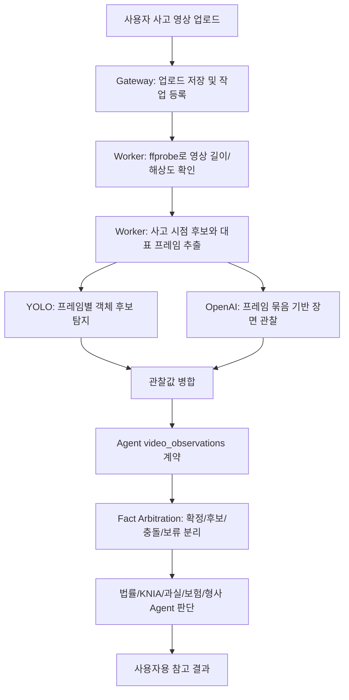

# 영상처리 및 Agent 발표 인수인계 정리

작성일: 2026-05-31  
목적: 발표자료 작성자가 영상처리와 Agent 파트를 빠르게 이해하고, 현재 구현을 과장 없이 설명할 수 있도록 핵심 흐름과 자문 반영 내용을 정리한다.

## 1. 발표용 핵심 문장

LawCompass의 영상처리와 Agent 파트는 사고 영상을 바로 판결하거나 과실비율을 확정하는 구조가 아니다. 영상에서 사고 판단에 필요한 객관적 관찰값을 만들고, 사용자의 선택 입력과 자연어 설명, KNIA 과실비율 기준, 법령/판례 근거를 Agent가 함께 검토해 참고용 과실 범위와 대응 방향을 제시하는 구조다.

발표에서는 다음 표현이 가장 안전하다.

```text
영상 분석은 사고 결론을 바로 내리는 모델이 아니라, 사고 시점·충돌 대상·차선·신호·정차·주변 객체 같은 관찰 후보를 만드는 단계입니다.
Agent는 이 관찰 후보를 사용자 입력과 KNIA/법령 근거와 비교해 확정, 보류, 충돌, 조건부 결과로 나눕니다.
```

## 2. 내가 맡은 범위 요약

| 담당 범위 | 설명 |
| --- | --- |
| 영상 전처리 | 업로드된 사고 영상을 ffmpeg/ffprobe로 분석하고 대표 프레임과 사고 시점 후보 프레임을 추출한다. |
| YOLO 보조 관찰 | 추출된 프레임에서 차량, 사람, 자전거, 이륜차, 신호등 같은 객체 후보를 찾는다. YOLO는 사고 판단 모델이 아니라 객체 관찰 모델이다. |
| OpenAI 프레임 분석 | 선택된 프레임 묶음에서 충돌 지점, 사고 구간 후보, 중앙선/신호/정차 등 정량 관찰값을 만든다. |
| 영상 관찰값 계약 | 프레임 분석 결과를 `video_observations` 형태로 정리하고, 확정값·후보값·확인 필요·충돌 상태를 분리한다. |
| Agent 사실 중재 | 영상 관찰값과 사용자 입력이 다를 때 한쪽을 무조건 믿지 않고, 신뢰도와 근거를 기준으로 보류 또는 질문으로 넘긴다. |
| Agent 역할 고도화 | 법률, KNIA, 과실비율, 형사책임, 보험 처리, 근거 감사, 표현 정책 Agent의 역할과 금지 권한을 분리했다. |
| 결과 품질 검증 | 특정 사고 영상에만 맞춘 규칙이 생기지 않도록 reference metrics, Agent 전체 테스트, 사용자 가치 검증을 추가했다. |

## 3. 영상처리 흐름

현재 YOLO와 OpenAI는 원본 영상 전체를 직접 판단하는 것이 아니라, Worker가 추출한 프레임들을 분석한다.



### YOLO의 역할

- YOLO는 영상 전체의 맥락을 이해하는 모델이 아니다.
- Worker가 추출한 프레임 이미지에서 객체 후보와 위치를 찾는다.
- `person`이 감지됐다고 차대사람 사고로 확정하지 않는다.
- `bicycle`, `motorcycle`, `vehicle`도 단순히 보인다는 이유만으로 직접 충돌 대상으로 승격하지 않는다.
- 실제 충돌 대상이 되려면 충돌 시점, 접촉 근거, 프레임 근거, 사용자 입력, OpenAI 관찰값이 함께 맞아야 한다.

### OpenAI 프레임 분석의 역할

- 대표 프레임과 사고 시점 후보 프레임을 묶어 장면 단서를 해석한다.
- 예: 충돌 지점 보임, 중앙선 침범, 대향 차량 존재, 정차 여부, 상대 신호 미확인, 보행자 주변 맥락 등.
- 단, OpenAI 결과도 바로 결론이 아니라 `confidence`, `frame_refs`, `source`가 붙은 관찰 후보로 들어간다.

## 4. 사용자 입력과 영상 정보의 반영 기준

영상은 객관적 근거에 가깝지만, 영상 분석도 오인 가능성이 있으므로 무조건 확정하지 않는다. 현재 프로젝트는 출처별 반영 강도를 다르게 둔다.

| 출처 | 반영 강도 | 발표 설명 |
| --- | ---: | --- |
| 영상 관찰값 | 최대 0.90 | 프레임 근거가 있는 객관 관찰값. 단, 확정 전 중재 과정을 거친다. |
| 사고 대분류 선택 | 0.85 | 사용자가 고른 차대차, 차대사람, 차대자전거 등 큰 사고축이다. |
| 구조화 후속 답변 | 0.85 | 버튼/선택형 질문으로 받은 명확한 추가 정보다. |
| 세부 사고유형 선택 | 0.70 | 후미추돌, 차로변경, 교차로 충돌 같은 초기 추정이다. |
| KNIA 기준 | 0.55 | 사고 사실이 아니라 과실비율 참고 기준이다. |
| 법령/판례 근거 | 0.50 | 판단 설명을 위한 근거다. |
| 자연어 설명 | 0.30 | 사용자의 주관적 설명이므로 낮은 비중으로만 반영한다. |

핵심은 자연어 설명이 영상이나 구조화 답변을 덮어쓰지 못하게 한 점이다. 예를 들어 사용자가 “사람을 친 것 같다”고 적어도 영상과 대분류가 차대차이면 바로 차대사람 사고로 바꾸지 않는다.

### 발표용 수치화 포인트

발표에서는 위 표를 그대로 보여주기보다, “어떤 입력을 더 신뢰하도록 설계했는지”를 수치로 단순화해서 설명하면 이해가 쉽다. 단, 이 값은 과실비율을 자동 산식으로 계산하는 고정 공식이 아니라 Agent fact arbitration에서 출처별 우선순위를 설명하기 위한 기준이다.

| 비교 항목 | 수치 설명 | 발표에서 말할 내용 |
| --- | ---: | --- |
| 영상 정량 관찰값 : 자연어 설명 | 0.90 : 0.30, 약 3 : 1 | 사용자가 적은 말보다 프레임 근거가 있는 관찰값을 약 3배 강하게 본다. |
| 영상 정량 관찰값 : 구조화 선택 입력 | 0.90 : 0.85, 거의 1 : 1 | 대분류, 후속 선택처럼 사용자가 명확히 고른 값은 영상과 거의 같은 수준으로 본다. |
| 구조화 선택 입력 : 자연어 설명 | 0.85 : 0.30, 약 2.8 : 1 | 긴 서술보다 버튼/선택형 답변을 더 안정적인 입력으로 본다. |
| 세부 사고유형 : 자연어 설명 | 0.70 : 0.30, 약 2.3 : 1 | 후미추돌, 교차로 충돌 같은 선택형 사고유형은 자연어보다 강한 단서다. |
| 영상 관찰값 : KNIA/법령 근거 | 0.90 : 0.55/0.50 | 영상은 사고 사실 후보를 만들고, KNIA/법령은 그 사실에 맞는 근거인지 검증하는 축이다. |

발표용으로 더 단순하게 말하면 다음과 같다.

```text
사고 사실을 정리할 때는 영상 정량 관찰값과 구조화된 사용자 입력을 가장 강하게 반영하고, 자연어 설명은 보조 단서로 낮게 반영합니다.
현재 우선순위 기준으로 보면 영상 관찰값은 자연어 설명보다 약 3배 강하고, 사용자가 버튼으로 고른 대분류/후속 답변은 영상과 거의 같은 수준으로 취급합니다.
```

결과 화면에서 과실비율을 만들 때는 다음 순서로 조정한다.

| 결과 반영 단계 | 수치화 가능한 기준 | 의미 |
| --- | --- | --- |
| 1단계: 사고 사실 확정 | 영상 관찰값 0.90, 구조화 입력 0.85 우선 | 무엇과 부딪혔는지, 정차 여부, 신호, 차선, 중앙선 같은 사고 사실을 먼저 정한다. |
| 2단계: 주관 설명 보정 | 자연어 설명 0.30 | 사용자의 설명은 맥락 보조로 쓰되, 영상/선택형 입력과 충돌하면 바로 확정하지 않는다. |
| 3단계: 근거 매칭 | KNIA 0.55, 법령/판례 0.50 | 확정된 사고 사실에 맞는 기준만 primary 근거로 쓰고, 사고축이 다르면 제외하거나 secondary로 내린다. |
| 4단계: 결과 표현 | 확정/조건부/추가 확인 필요로 분리 | 근거가 부족하면 50:50 같은 단순 fallback을 확정값처럼 말하지 않는다. |

이 구조 때문에 LawCompass는 “영상 70%, 사용자 입력 30%”처럼 단순 평균을 내는 방식이 아니다. 더 정확히는 `영상 정량 관찰값`과 `구조화된 사용자 입력`을 상위 fact source로 두고, `자연어 설명`은 낮은 보조값으로 두며, `KNIA/법령`은 사고 사실을 만드는 값이 아니라 그 사실에 맞는 근거인지 검증하는 값으로 분리한다.

## 5. AI Agent가 프로젝트에서 활용되는 방식

대회 주제가 AI Agent를 활용한 SW 개발이므로, 발표에서는 “Agent가 어디에 쓰였는지”를 명확히 보여주는 것이 중요하다.

LawCompass의 Agent는 단순 챗봇이 아니라, 교통사고 분석 과정을 여러 역할로 나누어 처리하는 통제된 Agent pipeline이다.

| Agent 역할 | 하는 일 | 하지 않는 일 |
| --- | --- | --- |
| 영상 관찰 Agent | 프레임에서 보이는 사고 단서와 신뢰도를 정리한다. | 과실비율을 산정하지 않는다. |
| 사실 중재 Agent | 사용자 입력과 영상 관찰값을 비교해 확정/후보/충돌/질문 대상을 나눈다. | 사용자 입력 없는 사실을 단정하지 않는다. |
| 교통사고 법률 Agent | 확인된 facts와 법령/판례 근거를 바탕으로 법률 쟁점을 설명한다. | 최종 판결을 확정하지 않는다. |
| KNIA 기준 Agent | 사고축에 맞는 과실비율 인정기준을 찾고 mismatch를 걸러낸다. | 사고축이 다른 기준을 primary로 채택하지 않는다. |
| 과실비율 Agent | 참고 과실 범위와 조건부 분기를 제시한다. | 근거 없는 50:50 fallback을 남용하지 않는다. |
| 형사책임 Agent | 12대 중과실, 인명피해, 신고 의무 같은 형사 리스크를 조건부 점검한다. | 유죄/무죄를 확정하지 않는다. |
| 보험 처리 Agent | 대인/대물 접수, 증빙 보전, 보험 대응 절차를 안내한다. | 보험금 지급을 확정하지 않는다. |
| 근거 감사 Agent | 주장과 근거의 직접성, unsupported claim을 검증한다. | 새 법률 주장을 만들지 않는다. |
| 표현 정책 Agent | 사용자에게 확정/참고/조건부 상태를 안전한 한국어로 표시한다. | 불확실성을 숨기지 않는다. |

## 6. Task-Plan-Goal과 MCP-like 구조 설명

현재 프로젝트는 표준 MCP 서버/클라이언트를 완전히 붙인 구조는 아니다. 대신 Agent 내부에 MCP-like tool registry/executor와 Task-Plan-Goal 추적 구조를 만들었다.

발표 표현:

```text
현재는 표준 MCP 전체 구현이 아니라, Agent 내부에서 허용된 도구를 schema, 권한, 실패 packet, trace metadata와 함께 관리하는 MCP-like 구조입니다.
이를 통해 KNIA 검색, 법률 RAG, 근거 감사 같은 도구 호출을 추후 표준 MCP로 확장할 수 있게 경계를 정리했습니다.
```

Task-Plan-Goal 관점에서는 다음처럼 설명한다.

| 개념 | 프로젝트 적용 |
| --- | --- |
| Task | 입력 정규화, 영상 관찰, 사실 중재, KNIA 검색, 법률 근거 검색, 과실비율 산정 같은 단위 작업 |
| Plan | 텍스트만, 영상만, 텍스트+영상, 보완 답변 재분석에 따라 필요한 Task 순서를 구성 |
| Goal | 각 Task가 달성해야 하는 결과. 예: 사고 대상 확인, 근거 적합성 확보, 조건부 결과 생성 |
| Observation | 영상 프레임 관찰값, 도구 실행 결과, 실패/부족 정보 |
| Quality Packet | 신뢰도, 근거 부족, 실패 관찰값, 추가 확인 필요 여부를 담은 품질 메타데이터 |

## 7. 자문 Q&A가 현재 프로젝트에 반영된 방식

첨부 자문 결과보고서의 질문과 피드백은 현재 구조에 다음처럼 반영되어 있다.

| 자문 내용 | 현재 반영 |
| --- | --- |
| 한문철 변호사도 어려운 과실 산정인데 AI가 판결 가능하냐 | 실제 판결 확정이 아니라 유사 기준 기반 참고 범위, 조건부 결과, 추가 확인 필요로 표시한다. |
| 현재 어디까지 구현됐나 | Gateway-Worker-Agent-DB 구조, 영상 전처리, KNIA/법령 근거, 결과 report 조립, 관리자 진단 화면까지 연결됐다. |
| LLM이 영상을 넣었을 때 맥락을 제대로 파악하나 | 영상 전체를 한 번에 믿지 않고, 프레임 추출 후 YOLO/OpenAI 관찰값을 나누고 Agent 중재를 거친다. |
| 영상만 API로 올려 전적으로 의존하는가 | 아니다. 사고 대분류, 세부유형, 후속 질문, 자연어 설명, 영상 관찰값, KNIA/법령 근거를 결합한다. |
| 사용자 텍스트는 주관적이고 영상은 객관적이다 | 자연어 설명은 낮은 가중치로 두고, 영상 관찰값과 구조화 답변을 더 높게 반영한다. |
| 여러 AI 페르소나가 어떤 결과를 내는가 | 법률, KNIA, 과실, 형사, 보험, 근거 감사, 표현 정책 역할로 나누고 각자 판단 권한과 금지 권한을 분리했다. |
| 클라우드 영상 API 비용 문제 | 현재는 OpenAI+YOLO 구조이고, 추후 Qwen2.5-VL 로컬, Gemini 비교, 모바일 ML Kit/MediaPipe 선처리를 검토 대상으로 문서화했다. |
| 법제처/판례 API 적극 연동 | 법령/공공 API, KNIA JSON/RAG, pgvector 기반 근거 검색 구조를 사용한다. 단, 원문 coverage 확장은 계속 보강 대상이다. |
| 실제 패닉 상황 UX 검증 | 긴 설명을 요구하지 않고 사고 대분류 선택, 영상 업로드, 필요한 후속 질문 중심으로 흐름을 조정했다. |

## 8. 프로젝트 구조 보강 내용

영상처리와 Agent 개발만 한 것이 아니라, 전체 프로젝트 구조가 깨지지 않도록 다음 기준을 점검하고 보강했다.

| 보강 항목 | 내용 |
| --- | --- |
| 서비스 책임 분리 | Frontend, Gateway, Worker, Agent의 역할을 분리했다. 영상 전처리는 Worker, 판단은 Agent, 표시 조립은 Gateway, 화면은 Frontend가 담당한다. |
| 단일 책임 원칙 | Gateway route, Frontend composable, Agent stage, Worker job 처리 파일이 한 파일에 과도하게 몰리지 않도록 서비스/helper/contract로 나누었다. |
| 영상 관찰값 오염 방지 | 보행자, 횡단보도, 자전거, 이륜차, 신호등이 보인다는 이유만으로 사고 대분류가 바뀌지 않도록 guard를 추가했다. |
| 근거 finality | 근거가 충분한 결과, 조건부 결과, 참고용 결과, 추가 확인 필요 결과를 분리했다. |
| 관리자 진단 | 관리자 테스트 화면에서 Agent 전달 전 영상 처리 결과, YOLO/OpenAI 관찰값, 병합 관찰값을 확인할 수 있게 했다. |
| 검증 체계 | Agent 전체 테스트, 사용자 가치 검증, reference metrics, Frontend/Gateway build/test를 문서와 스크립트로 정리했다. |

P12 전체 점검 기준으로 최종 검증한 항목은 다음과 같다.

- Agent 전체 실행 품질 검증: 전체 Agent 테스트 통과
- 사용자 가치 검증: 법률 관점, 보험 처리, 근거, 추가 확인 항목 표시 점검
- Reference metrics: 직접 충돌 대상, 사고 대분류, 오염 방지, 조건부 분기 coverage 점검
- Frontend/Gateway build/test 통과
- 문서와 실제 코드 구조 일치 점검

## 9. 발표 슬라이드 구성 추천

팀원이 발표자료를 만들 때는 다음 순서가 좋다.

1. 문제 정의
   - 사고 직후 사용자는 과실비율, 신고 여부, 보험 대응, 증거 보전 방법을 알기 어렵다.
2. 자문 반영 방향
   - AI가 판결을 확정하는 것이 아니라 유사 기준 기반 참고 가이드를 제공하도록 목표를 조정했다.
3. 전체 아키텍처
   - Vue Frontend, Fastify Gateway, Python Worker, FastAPI Agent, PostgreSQL/Redis 구조.
4. 영상처리 흐름
   - 영상 업로드, 프레임 추출, YOLO 객체 후보, OpenAI 프레임 관찰, Agent 중재.
5. 영상과 사용자 입력 비중
   - 영상 관찰값은 높게, 자연어 설명은 낮게, 구조화 답변은 높게 반영.
6. AI Agent 분업
   - 영상 관찰, 사실 중재, 법률, KNIA, 과실비율, 형사, 보험, 근거 감사, 표현 정책 Agent.
7. 오염 방지 예시
   - 사람이 화면에 보여도 실제 충돌 대상이 아니면 차대사람 사고로 승격하지 않는다.
8. 결과 표시 방식
   - 과실비율은 확정값이 아니라 참고 범위, 조건부 결과, 추가 확인 항목으로 표시.
9. 구조 보강과 검증
   - SRP, Task-Plan-Goal trace, MCP-like tool registry, P12 전체 점검.
10. 한계와 후속
   - 판례/KNIA 원문 coverage 확장, 로컬 VLM 비교, 모바일 ML Kit/MediaPipe 선처리, S3 전환.

## 10. 발표에서 피해야 할 표현

| 피해야 할 표현 | 이유 | 대신 쓸 표현 |
| --- | --- | --- |
| AI가 판결을 예측한다 | 과장이고 법률적으로 위험하다 | 유사 기준 기반 참고 결과를 제공한다 |
| YOLO가 사고를 판단한다 | YOLO는 객체 감지 모델이다 | YOLO는 프레임별 객체 후보를 만든다 |
| 영상만으로 과실비율을 확정한다 | 영상 분석도 오인 가능성이 있다 | 영상 관찰값을 사용자 입력과 근거로 중재한다 |
| 표준 MCP를 완전히 구현했다 | 현재는 내부 MCP-like 구조다 | MCP-like tool registry/executor를 구성했다 |
| 각 Agent가 완전히 독립 프로세스로 동작한다 | 현재는 Agent 내부 역할 기반 분석 모듈이다 | 역할별 Specialist Agent 계약을 분리했다 |
| KNIA/판례 DB가 완전하다 | coverage는 계속 보강 대상이다 | 근거가 부족하면 추가 확인 또는 reference-only로 표시한다 |

## 11. 팀원에게 바로 전달할 요약

```text
내가 맡은 부분은 영상에서 객관적인 사고 관찰값을 뽑고, 그 값을 Agent가 사용자 입력·KNIA 기준·법령 근거와 조율하도록 만든 부분이야.
영상은 ffmpeg로 프레임을 뽑고, YOLO는 프레임에서 객체 후보를 감지하고, OpenAI는 프레임 묶음에서 충돌 지점/차선/신호/정차 같은 장면 단서를 분석해.
이 결과는 바로 과실비율이 되는 게 아니라 video_observations 계약으로 들어가고, Agent가 확정/후보/보류/충돌 상태로 나눠.
AI Agent는 단순 챗봇이 아니라 영상 관찰, 사실 중재, 법률, KNIA, 과실비율, 형사, 보험, 근거 감사, 표현 정책 역할로 나눠서 각자 권한 안에서 결과를 만든다는 식으로 설명하면 돼.
발표에서는 판결 확정이 아니라 근거 기반 참고 가이드라는 점, 영상과 사용자 입력을 함께 쓰되 자연어 설명은 낮은 비중으로 처리한다는 점, 사람이 보인다고 차대사람 사고로 오염되지 않게 guard를 둔 점을 강조하면 좋아.
```
